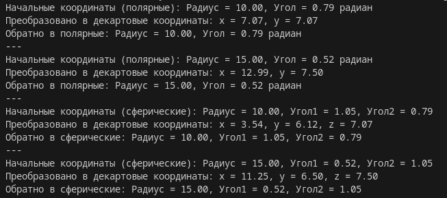
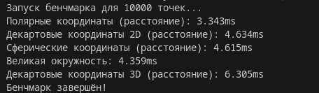

# Coordinate transformation
Completed

## Overview

This project handles conversions between coordinate systems and calculates distances in those systems. It supports:

- **2D**: Cartesian and Polar systems.  
- **3D**: Cartesian and Spherical systems.  

It also benchmarks the speed of these calculations with random data.




## Features

- **Conversions**:
  - 2D: Polar ↔ Cartesian.  
  - 3D: Spherical ↔ Cartesian.  

- **Distance Calculations**:
  - 2D: Cartesian and Polar.  
  - 3D: Cartesian and Spherical (volumetric and great-circle).  

- **Performance Benchmarking**:
  - Test the speed of distance calculations.

---

## How to Run

1. **Test Accuracy**  
   Run to check if conversions work correctly:  
   ```bash
   node ./test/coordinate.test.js
   ```

2. **Benchmark Performance**  
   Run to measure calculation speed:  
   ```bash
   node ./test/coordinate.benchmark.js
   ```  